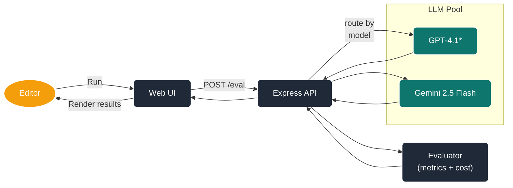

# PromptLab MVP

> **LLM prompt sandbox** with live metrics on _GPT-4.1 (+ mini / nano)_ and _Gemini 2.5 Flash_.  
> Built to show real Node + TS chops, not slide-deck vapourware.

---

## ✨ Features

- **Multi-model**: GPT-4.1 (full, mini, nano) and Gemini 2.5 Flash.
- **Automated eval**: embedding-cosine, exact-match & length heuristics; DeepEval/BERTScore pluggable.
- **Cost & latency tracking** baked into every run.
- **React UI** with history pane — no backend refresh.
- **CI gate** fails if your latest prompt degrades benchmark.
- **Coverage gate**: `@prompt-lab/evaluator` must keep ≥90% test coverage;
  any ESLint warning fails CI.
- **Monorepo** (`pnpm`) with strict TypeScript.

---

## 🗂️ Architecture



---

## 🛠️ Setup

```bash
cp .env.example .env
```

Edit `.env` and provide values for `OPENAI_API_KEY` and `GEMINI_API_KEY`.

---

## 🚀 Quick Start

```bash
git clone https://github.com/you/prompt-lab.git
cd prompt-lab
pnpm install

cp .env.example .env    # add OPENAI_API_KEY & GEMINI_API_KEY
pnpm dev
# starts API (3000) and Vite (5173) with proxy – no URL tweaks needed
```

Then visit `http://localhost:5173`.

---

### Local build

```bash
pnpm build:api && pnpm --filter web run build
```

### Docker

```bash
docker build -t promptlab:latest .
docker run -d -p 3000:3000 promptlab:latest
```

Then hit `http://localhost:3000/health`.

---

## 🛠️ Dev Scripts

| Command                     | Purpose                                      |
| --------------------------- | -------------------------------------------- |
| `pnpm dev`                  | Vite front-end + ts-node-dev API             |
| `pnpm test`                 | Vitest unit                                  |
| `pnpm test:e2e`             | Full prompt-eval; fails if `avgCosSim < 0.7` |
| `pnpm tsc`                  | Type-check all pkgs                          |
| `pnpm lint` / `pnpm format` | Lint & auto-format                           |

Run `pnpm test` and `pnpm lint` locally to catch coverage or lint issues before opening a PR.

---

## 📦 Folder Structure

```text
prompt-lab/
├─ apps/
│  ├─ api/            # Express + Zod
│  └─ web/            # React + shadcn/ui
├─ packages/
│  ├─ evaluator/      # Metrics lib
│  └─ test-cases/     # JSONL fixtures
```

---

## 📋 Stretch Goals

- Adapter layer for “bring-your-own” model.
- GPT self-eval metric vs. embedding cosine.
- Micro RAG experiment tracking hallucination.

---

## 🛑 Disclaimers

- No cloud creds stored—use your own `.env`.
- Test cases are synthetic.
- MIT licence; double-check token cost before running `pnpm test:e2e`.

---

 

_End of README.md_
